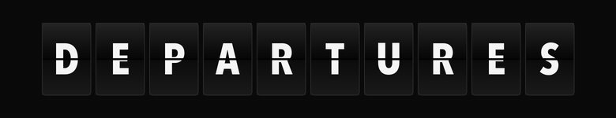

<div align="center">
  
</div>

<div align="center">

[](https://github.com/Staberman/splitflap/actions/workflows/ci.yml)
[](https://swift.org)
[](#requirements)
[](#installation)
[](LICENSE)

</div>

---

Mechanical split-flap displays — the ones that clatter through the alphabet in
old train stations — rendered in SwiftUI. Tiles flip, rows spell themselves out
left to right, and nothing depends on anything but SwiftUI.

## Installation

Add the package in Xcode via **File → Add Package Dependencies**, or in
`Package.swift`:

```swift
dependencies: [
    .package(url: "https://github.com/Staberman/splitflap.git", from: "1.0.0")
]
```

## Usage

### A row of text

```swift
import SplitFlap

SplitFlapRow(text: "BUENOS AIRES", theme: .classic, columns: 14)
```

Change `text` and the tiles flip to the new value, each column a beat after the
one before. Text is upper-cased, cut to `columns`, and padded with blanks — so
a row is always the same width, whatever it says.

### A single tile

```swift
SplitFlapTile(value: "7", theme: .classic)
    .frame(width: 44, height: 60)
```

The tile fills whatever frame you hand it, and scales its type to match.

### Spelling itself out on appear

```swift
SplitFlapRow(
    text: "DEPARTURES",
    theme: .midnight,
    columns: 10,
    cascadesOnAppear: true
)
```

Stagger several rows with `cascadeDelay` and a board spells itself line by line.

### Sound and haptics

The package makes no noise of its own. `onFlip` fires on the main actor each
time a row changes, and what happens next is yours:

```swift
SplitFlapRow(text: gate, theme: .classic, columns: 4) {
    SoundEffect.clack.play()
}
```

### Themes

Four are bundled — `.classic`, `.daylight`, `.midnight`, `.retro` — and a theme
is just two colours, so your own is one line:

```swift
let terminal = SplitFlapTheme(
    id: "terminal",
    card: Color(white: 0.08),
    digit: .green
)
```

## Performance

A board is a lot of layers. Every tile draws two clipped halves, two rotated
halves while it flips, a shadow and a stroke — and SwiftUI walks all of them on
every frame, for every tile, even the ones that never change.

On a large board most rows *never* change: filler lines, closed rows, values
restored from disk. `SplitFlapStaticRow` draws one of those in a single
`Canvas` pass — one layer instead of dozens:

```swift
SplitFlapStaticRow(text: "— — — — —", theme: .classic, columns: 5)
```

It is pixel-identical to a row of resting tiles. Use it for anything that will
not flip, and keep `SplitFlapRow` for what will. On the board this package came
from, that single swap cut re-rendered layers per frame by about 92%.

## Accessibility

- **Reduce Motion** is honoured: tiles change value without animating, and
  rows skip their cascade.
- A row is one accessibility element labelled with its full text — VoiceOver
  reads `BUENOS AIRES`, not fourteen separate letters.

## Requirements

iOS 17 · macOS 14 · tvOS 17 · visionOS 1 · Swift 5.9

## Credits

Extracted from **Pomotti**, a split-flap focus timer for iPhone, iPad and Mac.

## License

MIT — see [LICENSE](LICENSE). Use it, ship it, no attribution required.
